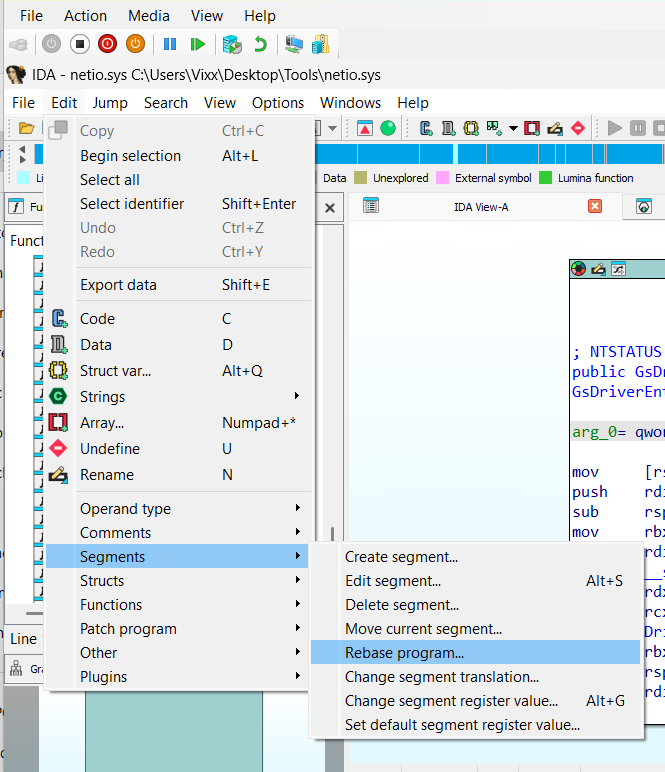
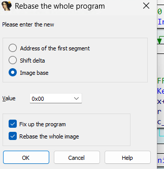

# Network Callout Kernel Callbacks Bypass

## Warning

Even though you can download the binaries from the `releases`, you have to make sure that the offsets and the binary search opcodes done is the same on your windows version or you will get a **BLUE SCREEN OF DEATH**

## Prerequisistes

This is an advanced topic requiring the following prerequisites:

- Assembly understanding

- Familiarity with C programming

- Experience with WinDbg

- Familiarity with IDA

- Windows kernel exploitation knowledge.

## Tools Used

WinDbg: [Windows Debugging Tools](https://learn.microsoft.com/en-us/windows-hardware/drivers/debugger/)

IDA: [Hex-Rays IDA Free](https://hex-rays.com/ida-free)

## Kernel Debugging Setup

To debug your local kernel (for fixing your offsets and reversing), follow the instructions here: [Setting up local kernel debugging](https://learn.microsoft.com/en-us/windows-hardware/drivers/debugger/setting-up-local-kernel-debugging-of-a-single-computer-manually)

## Target Audience

This project is for both pentesters and defenders to understand how attackers can bypass EDR kernel implementations.

## Purpose

- For everyone to be able to learn how technically bypassing EDR (Network Callbacks) is done.
- For having the flexibility to create your own tool which make it pretty easier to bypass signature based detection.
- For researchers to be able to play around the code and debug and reverse.

## Attacker Abuse Cases

An attacker with administrative privileges may attempt to disable EDR or install a rootkit. To interact with the kernel, a signed Microsoft driver is required. Since unsigned drivers cannot be loaded with Microsoft mitigations enabled (e.g., VBS, Hyper-V), attackers typically exploit vulnerable signed drivers that have not been blacklisted.

**NetworkCallbackKernelBypass project uses RTCORE64.sys driver which is not yet blocklisted by MICROSOFT**

## Introduction to Windows Filtering Platform (WFP) Callout Drivers

EDR And AV solutions can as well set up callbacks for network interactions.

A callout driver implements one or more callouts. Callouts extend the capabilities of the Windows Filtering Platform by processing TCP/IP-based network data in ways that are beyond the scope of the simple filtering functionality. Callouts are typically used to do the following tasks:

- Deep Inspection
- Packet Modification
- Stream Modification
- Data Logging

Reference: https://learn.microsoft.com/en-us/windows-hardware/drivers/network/introduction-to-windows-filtering-platform-callout-drivers

## How does it work

Reference: https://codemachine.com/articles/find_wfp_callouts.html

The variable netio!gWfpGlobal is the starting point for most WFP data structures.

<pre>
0: kd> dp   netio!gWfpGlobal L1
fffff880`017536a0  fffffa80`03718000 ;pointer to the WFP global structure
</pre>

The number of callouts and the pointer the array of callout structures is stored in this global table. To find the offset of these fields we can use the following technique

<pre>
lkd> u NETIO!FeInitCalloutTable L10
NETIO!FeInitCalloutTable:
fffff806`26a980b0 4053            push    rbx
fffff806`26a980b2 4883ec20        sub     rsp,20h
fffff806`26a980b6 488b05c38a0300  mov     rax,qword ptr [NETIO!gWfpGlobal (fffff806`26ad0b80)]
fffff806`26a980bd 0f57c0          xorps   xmm0,xmm0
fffff806`26a980c0 ba57667043      mov     edx,43706657h
fffff806`26a980c5 b900800100      mov     ecx,18000h
<mark>fffff806`26a980ca 0f118098010000  movups  xmmword ptr [rax+198h],xmm0</mark>
fffff806`26a980d1 4c8b05a88a0300  mov     r8,qword ptr [NETIO!gWfpGlobal (fffff806`26ad0b80)]
<mark>fffff806`26a980d8 4981c0a0010000  add     r8,1A0h</mark>
fffff806`26a980df e81cbffbff      call    NETIO!WfpPoolAllocNonPaged (fffff806`26a54000)
fffff806`26a980e4 488bd8          mov     rbx,rax
fffff806`26a980e7 4885c0          test    rax,rax
fffff806`26a980ea 7534            jne     NETIO!FeInitCalloutTable+0x70 (fffff806`26a98120)
fffff806`26a980ec 488b0d8d8a0300  mov     rcx,qword ptr [NETIO!gWfpGlobal (fffff806`26ad0b80)]
fffff806`26a980f3 33d2            xor     edx,edx
fffff806`26a980f5 41b800800100    mov     r8d,18000h
</pre>

The find the number of built in layers and the pointer to the array of callout structures use the following technique:

<pre>
lkd> dqs NETIO!gWfpGlobal L1
fffff806`26ad0b80  ffff8088`65705010
lkd> dqs ffff8088`65705010 + 0x198 L1 ;number of entries
ffff8088`657051a8  00000000`00000400
lkd> dqs ffff8088`65705010 + 0x198 + 0x08 L1 ;Pointer to array of callout structures
ffff8088`657051b0  ffff8088`6819a000
</pre>

To find the size of each structure in this array we can use the following technique :

<pre>
lkd> u NETIO!InitDefaultCallout
NETIO!InitDefaultCallout:
fffff806`26a98144 4053            push    rbx
fffff806`26a98146 4883ec20        sub     rsp,20h
fffff806`26a9814a 4c8d05ff860300  lea     r8,[NETIO!gFeCallout (fffff806`26ad0850)]
fffff806`26a98151 ba57667043      mov     edx,43706657h
fffff806`26a98156 b960000000      mov     ecx,<mark>60h</mark>
fffff806`26a9815b e8a0befbff      call    NETIO!WfpPoolAllocNonPaged (fffff806`26a54000)
</pre>

To display all the elements of the array use the following command template :

r $t0=array_base;.for ( r $t1=0; @$t1 < array_count; r $t1=@$t1+1 ) {dps @$t0+2*@$ptrsize L2; r $t0=@$t0+structure_size;}

<pre>
0: kd> r $t0=ffff8088`6819a000;.for ( r $t1=0; @$t1 < 11e; r $t1=@$t1+1 ) {dps @$t0+2*@$ptrsize L2; r $t0=@$t0+40;}
fffffa80`0509c000  00000000`00000000
fffffa80`0509c008  00000000`00000000
fffffa80`0509c010  00000000`00000000
fffffa80`0509c018  00000000`00000000
fffffa80`0509c020  00000000`00000000
fffffa80`0509c028  00000000`00000000
fffffa80`0509c030  00000000`00000000
fffffa80`0509c038  00000000`00000000
fffffa80`0509c040  00000001`00000001
fffffa80`0509c048  00000000`00000000
fffffa80`0509c050  fffff880`019bf640 tcpip!IPSecInboundTransportFilterCalloutClassifyV4 ;WFP callouts
fffffa80`0509c058  fffff880`0180f2c0 tcpip!IPSecInboundTransportFilterCalloutNotifyV6+0x2 ;WFP callouts
fffffa80`0509c060  00000000`00000000
fffffa80`0509c068  00000000`00000000
fffffa80`0509c070  00000000`00000000
fffffa80`0509c078  00000000`00000000
fffffa80`0509c080  00000001`00000001
.
.
.
</pre>

I implemented this in the c code, to enumerate and output all callout functions.

## Composition of a network callout entry

Reference: https://github.com/0mWindyBug/WFPCalloutReserach

Based on the shared research, he find out the structure as follows of each entry

<pre>
  *(_DWORD *)CalloutEntryPtr = a1;
  *(_DWORD *)(CalloutEntryPtr + 4) = 1;
  if ( a1 == 3 )
    *(_QWORD *)(CalloutEntryPtr + 40) = ClassifyFunction;
  else
    *(_QWORD *)(CalloutEntryPtr + 16) = ClassifyFunction;
  *(_DWORD *)(CalloutEntryPtr + 48) = Flags;
  *(_BYTE *)(CalloutEntryPtr + 73) = a6;
  *(_QWORD *)(CalloutEntryPtr + 24) = NotifyFn;
  *(_QWORD *)(CalloutEntryPtr + 32) = FlowDeleteFn;
  *(_BYTE *)(CalloutEntryPtr + 72) = 0;
  *(_WORD *)(CalloutEntryPtr + 74) = 0;
  *(_DWORD *)(CalloutEntryPtr + 76) = 0;
</pre>

what we are interested in in our code is the following:

- Offset 0x04 from the start of each network callout entry is equal = 0x01 (we can use that in our c code to identify an entry)
- ClassifyFunction is the function that is actually doing all the verifications on the network packet => which we need to overwrite.

## EnumerateNetworkFilters function in the c code

The Driver responsible for setting and adding the network filters is `NETIO.SYS`

### Find NETIO!gWfpGlobal

First we need to do a Binary Search for the pointer of `NETIO!gWfpGlobal` inside the non exported function `netio!FeInitCalloutTable`.

<pre>
NETIO!FeInitCalloutTable:
fffff800`365780b0 4053            push    rbx
fffff800`365780b2 4883ec20        sub     rsp,20h
<mark>fffff800`365780b6 488b05c38a0300  mov     rax,qword ptr [NETIO!gWfpGlobal (fffff800`365b0b80)]</mark>
fffff800`365780bd 0f57c0          xorps   xmm0,xmm0
</pre>

`NETIO!FeInitCalloutTable` is not an exported function, so we cannot get the address of the function directly in our c code.
We need to start the byte search using a function that is exported and close to `NETIO!FeInitCalloutTable`.

the functions needs to be exported to be able to use `GetProcAddress` and `GetModuleHandle` on them and get the function address.

So To find the closest exported functions (start and end) to use in our code as a starting point for the byte search, we can use IDA.

First let's get the offset to the function from the nt base

<pre>
lkd> ? NETIO!FeInitCalloutTable - NETIO
Evaluate expression: 360624 = <mark>00000000`000580b0</mark>
</pre>

Then copy the `netio.sys` from `c:/windows/system32` to open it in IDA.

Then in IDA, first of all we rebase the IMAGEBASE to 0x00, to make the offsets we get in `windbg` from the nt base the actual address in IDA, without any additional calculations.

Next we go the `Export table` in IDA and reorder all the functions by `address`.

Note: It will take some time for the addresses in the export table to be refreshed after the rebase.

And then you have to pick 2 functions where `000580b0` which is the address of `NETIO!FeInitCalloutTable` is between them.

As you can, from the screenshot `FeGetWfpGlobalPtr` and `KfdDeRefCallout` are the start and end functions that i will be using as `NETIO!FeInitCalloutTable` falls in between, so i can use `FeGetWfpGlobalPtr` as the start of the byte search.

The global structure contains an offset to the network filters entries and another offset to the number of entires.

To extract these offsets as they may change between windows versions, we will extract them from the same function dynamically.

Finding one of them is enough, as they are only 8 bytes away from each others.

<pre>
lkd> u NETIO!FeInitCalloutTable L10
NETIO!FeInitCalloutTable:
fffff806`26a980b0 4053            push    rbx
fffff806`26a980b2 4883ec20        sub     rsp,20h
fffff806`26a980b6 488b05c38a0300  mov     rax,qword ptr [NETIO!gWfpGlobal (fffff806`26ad0b80)]
fffff806`26a980bd 0f57c0          xorps   xmm0,xmm0
fffff806`26a980c0 ba57667043      mov     edx,43706657h
fffff806`26a980c5 b900800100      mov     ecx,18000h
<mark>fffff806`26a980ca 0f118098010000  movups  xmmword ptr [rax+198h],xmm0</mark>
fffff806`26a980d1 <mark>4c8b05</mark>a88a0300  mov     r8,qword ptr [NETIO!gWfpGlobal (fffff806`26ad0b80)]
fffff806`26a980d8 <mark>4981c0</mark>a0010000  add     r8,1A0h
fffff806`26a980df e81cbffbff      call    NETIO!WfpPoolAllocNonPaged (fffff806`26a54000)
fffff806`26a980e4 488bd8          mov     rbx,rax
fffff806`26a980e7 4885c0          test    rax,rax
fffff806`26a980ea 7534            jne     NETIO!FeInitCalloutTable+0x70 (fffff806`26a98120)
fffff806`26a980ec 488b0d8d8a0300  mov     rcx,qword ptr [NETIO!gWfpGlobal (fffff806`26ad0b80)]
fffff806`26a980f3 33d2            xor     edx,edx
fffff806`26a980f5 41b800800100    mov     r8d,18000h
lkd> dqs NETIO!gWfpGlobal L1
fffff806`26ad0b80  ffff8088`65705010
lkd> dqs ffff8088`65705010 + 0x198 L1
ffff8088`657051a8  00000000`00000400
lkd> dqs ffff8088`65705010 + 0x198 + 0x08 L1
ffff8088`657051b0  ffff8088`6819a000
</pre>

we need to pick bytes that are static and doesnt change between reboot. I highlighed what I will be searching for in my code (4c8b05 and 4981c0). and after finding the address in our code. we will get `fffff80626a980d1`.

After that we can calculate the global structure address and the offset in our code.

I used as well the function `InitDefaultCallout` to get the structure size of each network callout entry (0x60 in our case) using binary search by searching for `b9` and reading the structure size after the address is found.

<pre>
lkd> u NETIO!InitDefaultCallout
NETIO!InitDefaultCallout:
fffff806`26a98144 4053            push    rbx
fffff806`26a98146 4883ec20        sub     rsp,20h
fffff806`26a9814a 4c8d05ff860300  lea     r8,[NETIO!gFeCallout (fffff806`26ad0850)]
fffff806`26a98151 ba57667043      mov     edx,43706657h
fffff806`26a98156 <mark>b9</mark>60000000      mov     ecx,60h
fffff806`26a9815b e8a0befbff      call    NETIO!WfpPoolAllocNonPaged (fffff806`26a54000)
</pre>

At this point we were able to extract
- Number of entries => NETIO!gWfpGlobal + 0x198
- Pointer to array of callout structure => NETIO!gWfpGlobal + 0x1A0
- callout structure size (0x60)

So now we need a way to identify the start of a callout and where the callback is inside the structure.

Previous Research on the subject [WFPResearch](https://github.com/0mWindyBug/WFPCalloutReserach) come up with the following:

<pre>
  *(_DWORD *)CalloutEntryPtr = a1;
  <mark>*(_DWORD *)(CalloutEntryPtr + 4) = 1;</mark>
  if ( a1 == 3 )
    <mark>*(_QWORD *)(CalloutEntryPtr + 40) = ClassifyFunction;</mark>
  else
    <mark>*(_QWORD *)(CalloutEntryPtr + 16) = ClassifyFunction;</mark>
  *(_DWORD *)(CalloutEntryPtr + 48) = Flags;
  *(_BYTE *)(CalloutEntryPtr + 73) = a6;
  *(_QWORD *)(CalloutEntryPtr + 24) = NotifyFn;
  *(_QWORD *)(CalloutEntryPtr + 32) = FlowDeleteFn;
  *(_BYTE *)(CalloutEntryPtr + 72) = 0;
  *(_WORD *)(CalloutEntryPtr + 74) = 0;
  *(_DWORD *)(CalloutEntryPtr + 76) = 0;
</pre>

so based on that, we can identify the start of a callout structure by checking if `CalloutEntryPtr + 0x04 = 0x01` in our code

And the callback function based on the research is the `ClassifyFunction`

So the tool, will loop through the entries, identify each callback entry and resolve the `ClassifyFunction` to what driver it corresponds to and output it to the console.

And you can pick a driver or an address and the tool will remove it and overwrite it with a default classify function `FeDefaultClassifyCallback` that only does basic verifications on the packet (Based on previous [research](https://github.com/0mWindyBug/WFPCalloutReserach))

`FeDefaultClassifyCallback` is used by `InitDefaultCallout`

<pre>
lkd> u
NETIO!InitDefaultCallout+0x22:
fffff801`63968166 7573            jne     NETIO!InitDefaultCallout+0x97 (fffff801`639681db)
fffff801`63968168 488b0de1860300  mov     rcx,qword ptr [NETIO!gFeCallout (fffff801`639a0850)]
fffff801`6396816f 448d4060        lea     r8d,[rax+60h]
fffff801`63968173 33d2            xor     edx,edx
fffff801`63968175 e8c6cb0100      call    NETIO!_memset_spec_ermsb (fffff801`63984d40)
fffff801`6396817a 488b0dcf860300  mov     rcx,qword ptr [NETIO!gFeCallout (fffff801`639a0850)]
fffff801`63968181 <mark>488d05</mark>28ebfdff  lea     rax,[NETIO!FeDefaultClassifyCallback (fffff801`63946cb0)]
fffff801`63968188 <mark>c70104</mark>000000    mov     dword ptr [rcx],4
</pre>

`InitDefaultCallout` is not an exported function, so we need to find first an exported function close to `InitDefaultCallout` for our binary search.

<pre>
lkd> ? NETIO!InitDefaultCallout - NETIO
Evaluate expression: 360772 = 00000000`00058144
</pre>

And based on that offset and export table in IDA, we will find out that the functions falls between these 2 `FeGetWfpGlobalPtr` and `KfdDeRefCallout`.

and we will use the highlighed bytes for our search to resolve the address of `NETIO!FeDefaultClassifyCallback`

## Usage
<pre>
C:\Users\Vixx\Desktop\Tools\NetworkKernelBypass\x64\Release>NetworkCallbackKernelBypass.exe
Usage: NetworkCallbackKernelBypass.exe
 /networkfilters /show <drivername> - list all network filters or network filters related to a driver
 /networkfilters /driver <drivername> - Remove all classifyFn related to that driver
 /networkfilters /address <classyFn Address To Remove> - remove the classifyFn Address mentionned (make sure to add 0x before the address)
 /installDriver - Install the MSI driver
 /uninstallDriver - Uninstall the MSI driver
 </pre>

 ` /networkfilters /show` to show all filters and corresponding drivers.

 ### Disclaimer
This project is for **educational purposes only**. Unauthorized use of this tool in production or against systems without explicit permission is strictly prohibited.
